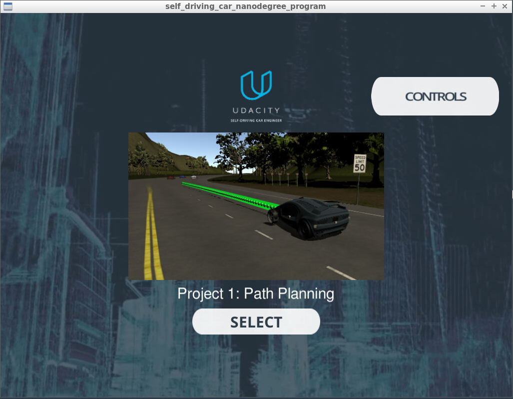
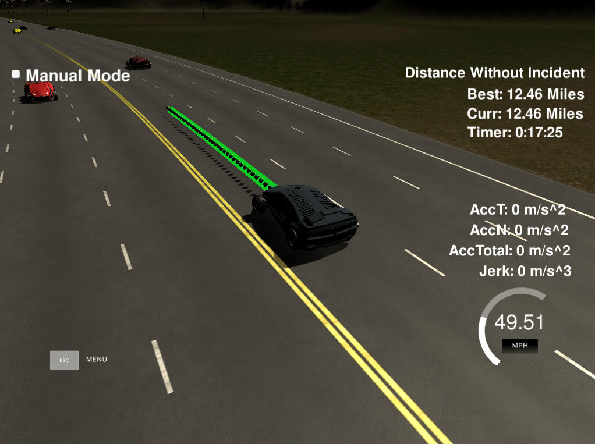

# CarND Path Planning Project
Self-Driving Car Engineer Nanodegree Program


# Overview

In this project the goal is to safely navigate around a virtual highway with other traffic that is driving +-10 MPH of the 50 MPH speed limit. A path planning algorithm is implemented to drive a car on a highway [simulator](https://github.com/udacity/self-driving-car-sim/releases/tag/T3_v1.2) provided by Udacity. The simulator sends car telemetry information (car's position and velocity) and sensor fusion information about the rest of the cars in the highway. It expects a set of points spaced in time at 0.02 seconds representing the car's trajectory. The communication between the simulator and the path planner is done using [WebSocket](https://en.wikipedia.org/wiki/WebSocket). The path planner uses the [uWebSockets](https://github.com/uNetworking/uWebSockets) implementation to handle this communication. Udacity provides a seed project to start from on this project ([here](https://github.com/udacity/CarND-Path-Planning-Project)).


# Dependencies & Prerequisites

The project has the following dependencies:

* cmake >= 3.5
  * All OSes: [click here for installation instructions](https://cmake.org/install/)
* make >= 4.1
  * Linux: make is installed by default on most Linux distros
  * Mac: [install Xcode command line tools to get make](https://developer.apple.com/xcode/features/)
  * Windows: [Click here for installation instructions](http://gnuwin32.sourceforge.net/packages/make.htm)
* gcc/g++ >= 5.4
  * Linux: gcc / g++ is installed by default on most Linux distros
  * Mac: same deal as make - [install Xcode command line tools]((https://developer.apple.com/xcode/features/)
  * Windows: recommend using [MinGW](http://www.mingw.org/)
* [uWebSockets](https://github.com/uWebSockets/uWebSockets)
  * Run either `install-mac.sh` or `install-ubuntu.sh`.
  * If you install from source, checkout to commit `e94b6e1`, i.e.
    ```
    git clone https://github.com/uWebSockets/uWebSockets
    cd uWebSockets
    git checkout e94b6e1
    ```
- Udacity's simulator.

For instructions on how to install these components on different operating systems, please, visit [Udacity](https://github.com/udacity/CarND-Path-Planning-Project).

# Compiling and Executing

The project is implemented in Udacity's workspace environment. Following is the example of building the project:

```
Installing dependencies.
Done. All dependencies installed.
root@cbc82d901e1f:/home/workspace# cd CarND-Path-Planning-Project/
root@cbc82d901e1f:/home/workspace/CarND-Path-Planning-Project# mkdir build && cd build
root@cbc82d901e1f:/home/workspace/CarND-Path-Planning-Project/build# cmake .. && make
-- The C compiler identification is GNU 5.4.0
-- The CXX compiler identification is GNU 5.4.0
-- Check for working C compiler: /usr/bin/cc
-- Check for working C compiler: /usr/bin/cc -- works
-- Detecting C compiler ABI info
-- Detecting C compiler ABI info - done
-- Detecting C compile features
-- Detecting C compile features - done
-- Check for working CXX compiler: /usr/bin/c++
-- Check for working CXX compiler: /usr/bin/c++ -- works
-- Detecting CXX compiler ABI info
-- Detecting CXX compiler ABI info - done
-- Detecting CXX compile features
-- Detecting CXX compile features - done
-- Configuring done
-- Generating done
-- Build files have been written to: /home/workspace/CarND-Path-Planning-Project/build
Scanning dependencies of target path_planning
[ 50%] Building CXX object CMakeFiles/path_planning.dir/src/main.cpp.o
[100%] Linking CXX executable path_planning
[100%] Built target path_planning
root@cbc82d901e1f:/home/workspace/CarND-Path-Planning-Project/build# ./path_planning
Listening to port 4567
```

Now the path planner is running and listening on port 4567 for messages from the simulator. Next step is to open Udacity's simulator:


## Simulator Interface

To run the simulator on Mac/Linux, first make the binary file executable with the following command:
```shell
sudo chmod u+x {simulator_file_name}
```



Click the "Select" button and good luck!


## Basic Build Instructions

1. Clone this repo.
2. Make a build directory: `mkdir build && cd build`
3. Compile: `cmake .. && make`
4. Run it: `./path_planning`.

Here is the data provided from the Simulator to the C++ Program

#### Main car's localization Data (No Noise)

["x"] The car's x position in map coordinates
["y"] The car's y position in map coordinates
["s"] The car's s position in frenet coordinates
["d"] The car's d position in frenet coordinates
["yaw"] The car's yaw angle in the map
["speed"] The car's speed in MPH

#### Previous path data given to the Planner

//Note: Return the previous list but with processed points removed, can be a nice tool to show how far along
the path has processed since last time.

["previous_path_x"] The previous list of x points previously given to the simulator
["previous_path_y"] The previous list of y points previously given to the simulator

#### Previous path's end s and d values

["end_path_s"] The previous list's last point's frenet s value
["end_path_d"] The previous list's last point's frenet d value

#### Sensor Fusion Data, a list of all other car's attributes on the same side of the road. (No Noise)

["sensor_fusion"] A 2d vector of cars and then that car's [car's unique ID, car's x position in map coordinates, car's y position in map coordinates, car's x velocity in m/s, car's y velocity in m/s, car's s position in frenet coordinates, car's d position in frenet coordinates.

#### The map of the highway is in data/highway_map.txt
Each waypoint in the list contains  [x,y,s,dx,dy] values. x and y are the waypoint's map coordinate position, the s value is the distance along the road to get to that waypoint in meters, the dx and dy values define the unit normal vector pointing outward of the highway loop.

The highway's waypoints loop around so the frenet s value, distance along the road, goes from 0 to 6945.554.

## Details

1. The car uses a perfect controller and will visit every (x,y) point it recieves in the list every .02 seconds. The units for the (x,y) points are in meters and the spacing of the points determines the speed of the car. The vector going from a point to the next point in the list dictates the angle of the car. Acceleration both in the tangential and normal directions is measured along with the jerk, the rate of change of total Acceleration. The (x,y) point paths that the planner recieves should not have a total acceleration that goes over 10 m/s^2, also the jerk should not go over 50 m/s^3. (NOTE: As this is BETA, these requirements might change. Also currently jerk is over a .02 second interval, it would probably be better to average total acceleration over 1 second and measure jerk from that.

2. There will be some latency between the simulator running and the path planner returning a path, with optimized code usually its not very long maybe just 1-3 time steps. During this delay the simulator will continue using points that it was last given, because of this its a good idea to store the last points you have used so you can have a smooth transition. previous_path_x, and previous_path_y can be helpful for this transition since they show the last points given to the simulator controller with the processed points already removed. You would either return a path that extends this previous path or make sure to create a new path that has a smooth transition with this last path.

# Project Specifications & Rubric

| Criteria  | Meet Specifications / Results|
| ------------- | ------------- |
| The code compiles correctly | Yes. |
| The car is able to drive at least 4.32 miles without incident.. | Simulator ran for more than 10 km without any accident. |
| The car drives according to the speed limit. | No warning is received. |
| Max Acceleration and Jerk are not Exceeded. | No warning is received. |
| Car does not have collisions. | No collisions happened. |
| The car stays in its lane, except for the time between changing lanes. | Yes. |
| The car is able to change lanes | Yes. |




## Reflection

The path planning algorithm is implemented in `../src/main.cpp` file by using the helper functions in `../src/helpers.h` and `../src/spline.h` file.

The implementation consists of 3 components;
1. Prediction Component
2. Behavior Component
3. Trajectory Planning


### Prediction Component

Estimates the actions of other objects from the sensory input for the near future. Most of the trajectories are assumed to be straight lines for other objects.

This component deals with the telemetry and sensor fusion data. It checks the following issues;
- Is there a car in the front blocking the traffic.
- Is there a car next to the right making the lane change not safe.
- Is there a car next to the left making a lane change not safe.

Each cars positions are gathered by sensor fusion.

A car is considered "dangerous" when its distance to our car is less than 30 meters in front and 25 meters behind us.

Following is the code implemented for the _Prediction Component_.

```cpp
int prev_path_size = previous_path_x.size();

if(prev_path_size > 0)
{
  car_s = end_path_s;
}

bool sensed_car_left= false;
bool sensed_car_right = false;
bool sensed_car_front = false;

for(int i=0; i < sensor_fusion.size(); i++)
{
  float d = sensor_fusion[i][6];
  int sensed_car_lane;
  /* Each lane is assumed to be 4 meter in width */
  // There are 3 lanes in total. Leftmost lane ID is 0, middle lane ID is 1 and rightmost lane ID is 2
  if(d >= 0 && d <= 4){sensed_car_lane = 0;}
  else if(d > 4 && d <= 8) {sensed_car_lane = 1;}
  else if(d > 8 && d <= 12) {sensed_car_lane = 2;}

  double sensed_velocity_x = sensor_fusion[i][3];
  double sensed_velocity_y = sensor_fusion[i][4];
  double sensed_car_velocity = sqrt((sensed_velocity_x*sensed_velocity_x)+(sensed_velocity_y*sensed_velocity_y));
  double sensed_car_s = sensor_fusion[i][5];

  // This will help to predict the where the vehicle will be in future
  sensed_car_s += ((double)prev_path_size*0.02*sensed_car_velocity);

  if(sensed_car_lane == lane) // A vehicle is on the same line and check the car is in front of the ego car
  {sensed_car_front |= sensed_car_s > car_s && (sensed_car_s - car_s) < 30;}
  else if((sensed_car_lane - lane) == -1) // A vehicle is on the left lane and check whether it is in 30 meter (front) 20 meter (backward) range
  {sensed_car_left |= (car_s + 30) > sensed_car_s  && (car_s - 20) < sensed_car_s;}
  else if((sensed_car_lane - lane) == 1)// A vehicle is on the right lane and check whether it is in 30 meter (front) 20 meter (backward) range
  {sensed_car_right |= (car_s + 30) > sensed_car_s  && (car_s - 20) < sensed_car_s;}
}
```

### Behavior Component
Determines the actions of Ego car while driving in the highway. These actions are;
 - The car drives according to the speed limit.
 - Max Acceleration and Jerk are not Exceeded.
 - Car does not have collisions by changing lanes or decreasing speed.
 - Decrease speed limit if there is no available/safe lanes to swith.

Following is the code implemented for the _Behavior Component_.

```cpp  
if(sensed_car_front)
{
  if(lane==0 && !sensed_car_right){lane++;}
  else if(lane==1 && !sensed_car_left){lane--;}
  else if(lane==1 && !sensed_car_right){lane++;}
  else if(lane==2 && !sensed_car_left){lane--;}
  else {velocity-=change_velocity_by;}
}
else if(velocity < top_velocity) {velocity += (1.2 * change_velocity_by);}
```


### Trajectory Planning

Calculates the trajectory based on the speed and lane output from the behavior component, car coordinates and past path points.

The last two points of the previous trajectory are used in conjunction with three points at a far distance to initialize the spline calculation. The coordinates are shifted and rotated to local car coordinates to make it less complicated for the spline calculation.

The pass trajectory points are copied to the new trajectory to ensure more continuity on the trajectory. The rest of the points are calculated by evaluating the spline and transforming the output coordinates.

Following is the code implemented for the _Trajectory Planning_.
```cpp
vector<double> ptsx;
vector<double> ptsy;

//Refrence x,y, and yaw states
double ref_x = car_x;
double ref_y = car_y;
double ref_yaw = deg2rad(car_yaw);

// If previous states are almost empty, use the car as a starting point
if (prev_path_size < 2)
{
  //Use two points thats makes path tangent to the car
  double prev_car_x = car_x - cos(car_yaw);
  double prev_car_y = car_y - sin(car_yaw);
  ptsx.push_back(prev_car_x);
  ptsx.push_back(car_x);
  ptsy.push_back(prev_car_y);
  ptsy.push_back(car_y);
}
else
{
  //Redefine the reference point to previous point
  ref_x = previous_path_x[prev_path_size - 1];
  ref_y = previous_path_y[prev_path_size - 1];
  double ref_x_prev = previous_path_x[prev_path_size - 2];
  double ref_y_prev = previous_path_y[prev_path_size - 2];
  ref_yaw = atan2(ref_y-ref_y_prev, ref_x-ref_x_prev);
  ptsx.push_back(ref_x_prev);
  ptsx.push_back(ref_x);
  ptsy.push_back(ref_y_prev);
  ptsy.push_back(ref_y);
}

// Setting up target points in the future.
vector<double> next_wp0 = getXY(car_s + 30, 2+4*lane, map_waypoints_s, map_waypoints_x, map_waypoints_y);
vector<double> next_wp1 = getXY(car_s + 60, 2+4*lane, map_waypoints_s, map_waypoints_x, map_waypoints_y);
vector<double> next_wp2 = getXY(car_s + 90, 2+4*lane, map_waypoints_s, map_waypoints_x, map_waypoints_y);
ptsx.push_back(next_wp0[0]);
ptsx.push_back(next_wp1[0]);
ptsx.push_back(next_wp2[0]);
ptsy.push_back(next_wp0[1]);
ptsy.push_back(next_wp1[1]);
ptsy.push_back(next_wp2[1]);

// Making coordinates to local car coordinates.
for (int i = 0; i < ptsx.size(); i++)
{
  double shift_x = ptsx[i] - ref_x;
  double shift_y = ptsy[i] - ref_y;
  ptsx[i] = shift_x * cos(0 - ref_yaw) - shift_y * sin(0 - ref_yaw);
  ptsy[i] = shift_x * sin(0 - ref_yaw) + shift_y * cos(0 - ref_yaw);
}

// Create the spline.
tk::spline s;
s.set_points(ptsx, ptsy);

vector<double> next_x_vals;
vector<double> next_y_vals;

//For the smooth transition, we are adding previous path points
for (int i=0; i<prev_path_size; i++)
{
  next_x_vals.push_back(previous_path_x[i]);
  next_y_vals.push_back(previous_path_y[i]);
}

// Calculate distance y position on 30 m ahead.
double target_x = 30.0;
double target_y = s(target_x);
double target_dist = sqrt(target_x*target_x + target_y*target_y);
double x_add_on = 0;

for(int i = 1; i < 50 - prev_path_size; i++)
{
  double N = target_dist/(0.02*velocity/2.24);
  double x_point = x_add_on + target_x/N;
  double y_point = s(x_point);
  x_add_on = x_point;
  double x_ref = x_point;
  double y_ref = y_point;

  //Rotate back to normal after rotating it earlier
  x_point = x_ref * cos(ref_yaw) - y_ref * sin(ref_yaw);
  y_point = x_ref * sin(ref_yaw) + y_ref * cos(ref_yaw);
  x_point += ref_x;
  y_point += ref_y;
  next_x_vals.push_back(x_point);
  next_y_vals.push_back(y_point);
}
```
